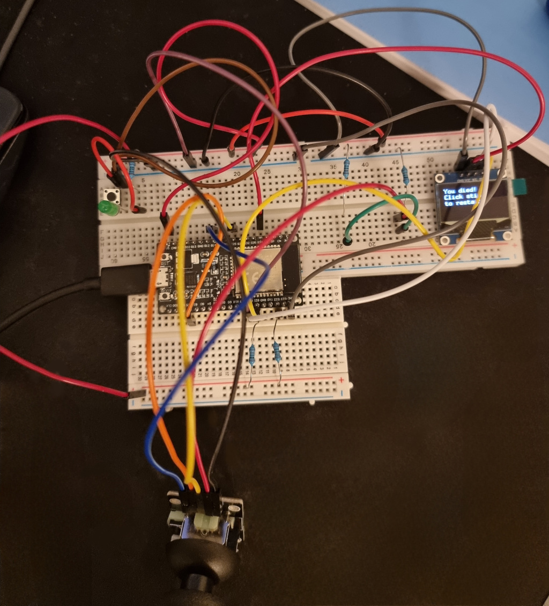

# Snake for ESP32 with Rust

This project implements the game Snake for an ESP32 microcontroller,
written in Rust.

This was written as a basic starter project.

Hardware:
- [ESP32-WROOM-32 board](https://www.az-delivery.de/en/products/esp32-developmentboard) - note this has an ESP32 Xtensa chip not a C series RISC-V one.
- [KY-023 Joystick module](https://www.az-delivery.de/en/products/joystick-modul) - note this has a click input too.
- [0.96 inch SSD1306 128x64 I2C OLED display](https://www.az-delivery.de/en/products/0-96zolldisplay)

Photo:



Video:

https://github.com/user-attachments/assets/54323a01-4e3c-4797-bbef-9ba5340bed02

Wokwi project (note does not build there due to Rust dependencies): https://wokwi.com/projects/413450202628576257


Embassy is used to run concurrent tasks (checking for input at a faster
rate than the game update rate). 

The joystick URX and URY axes inputs are handled with a built-in
Analogue-Digital Converter (be careful about the choice of GPIO pins as
the selection is limited). And the button click is handled with an
interrupt.

## Deployment

Install Rust and espup.

Then run:

```bash
$ source ~/export-esp.sh
$ cargo run --release
```

## Notes

Note the input voltage to the joystick had to be lowered via a voltage
divider to get a usable range, the voltage divider here used one 1k and
one 2k Ohm resistors to the 5V input.

Note the SCL and SDA pins to the I2C display needed pull-up resistors,
here I used 2k Ohm resistors to 5V.

## Known Issues

- The use of the buffered graphics mode means that the display becomes
  laggy for longer snake sizes. This could be reduced by using direct
  draws (to not redraw the whole screen) and increasing the baud rate of
  the I2C connection.

- Food can spawn next to the snake which is confusing on the monochrome
  display (and can result in instant victory too).

- The game is very easy on the current size / speed.

## Resources

- The Rust on ESP book - https://docs.esp-rs.org/book/
- nostd ESP32 Rust book - https://docs.esp-rs.org/no_std-training/01_intro.html
- ESP32 GPIO Interrupts - https://blog.theembeddedrustacean.com/esp32-embedded-rust-at-the-hal-gpio-interrupts
- GPIO usage with Embassy on ESP32 - https://dev.to/theembeddedrustacean/embassy-on-esp-gpio-5594
- I2C Scanner - https://dev.to/theembeddedrustacean/esp32-embedded-rust-at-the-hal-i2c-scanner-54mg
- ADC example - https://dev.to/theembeddedrustacean/esp32-embedded-rust-at-the-hal-analog-temperature-sensing-using-the-adc-3106

